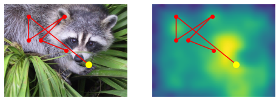

# DeepGaze I, DeepGaze II, DeepGaze IIE and DeepGaze III

This repository contains the pytorch implementations of DeepGaze I, DeepGaze II and DeepGaze IIE

## DeepGaze IIE

This is how use the pretained DeepGaze IIE model:

```python
import numpy as np
from scipy.misc import face
from scipy.ndimage import zoom
from scipy.special import logsumexp
import torch

import deepgaze_pytorch

DEVICE = 'cuda'

# you can use DeepGazeI or DeepGazeIIE
model = deepgaze_pytorch.DeepGazeIIE(pretrained=True).to(DEVICE)

image = face()

# load precomputed centerbias log density (from MIT1003) over a 1024x1024 image
# you can download the centerbias from https://github.com/matthias-k/DeepGaze/releases/download/v1.0.0/centerbias_mit1003.npy
# alternatively, you can use a uniform centerbias via `centerbias_template = np.zeros((1024, 1024))`.
centerbias_template = np.load('centerbias_mit1003.npy')
# rescale to match image size
centerbias = zoom(centerbias_template, (image.shape[0]/centerbias_template.shape[0], image.shape[1]/centerbias_template.shape[1]), order=0, mode='nearest')
# renormalize log density
centerbias -= logsumexp(centerbias)

image_tensor = torch.tensor([image.transpose(2, 0, 1)]).to(DEVICE)
centerbias_tensor = torch.tensor([centerbias]).to(DEVICE)

log_density_prediction = model(image_tensor, centerbias_tensor)
```

## DeepGaze III

DeepGaze III is a scanpath model, i.e., the model prediction depends not only on the viewed image, but also on where the observer fixated previously. This is how to use DeepGaze III:

```python
import matplotlib.pyplot as plt
import numpy as np
from scipy.misc import face
from scipy.ndimage import zoom
from scipy.special import logsumexp
import torch

import deepgaze_pytorch

DEVICE = 'cuda'

# you can use DeepGazeI or DeepGazeIIE
model = deepgaze_pytorch.DeepGazeIII(pretrained=True).to(DEVICE)

image = face()

# location of previous scanpath fixations in x and y (pixel coordinates), starting with the initial fixation on the image.
fixation_history_x = np.array([1024//2, 300, 500, 200, 200, 700])
fixation_history_y = np.array([768//2, 300, 100, 300, 100, 500])

# load precomputed centerbias log density (from MIT1003) over a 1024x1024 image
# you can download the centerbias from https://github.com/matthias-k/DeepGaze/releases/download/v1.0.0/centerbias_mit1003.npy
# alternatively, you can use a uniform centerbias via `centerbias_template = np.zeros((1024, 1024))`.
centerbias_template = np.load('centerbias_mit1003.npy')
# rescale to match image size
centerbias = zoom(centerbias_template, (image.shape[0]/centerbias_template.shape[0], image.shape[1]/centerbias_template.shape[1]), order=0, mode='nearest')
# renormalize log density
centerbias -= logsumexp(centerbias)

image_tensor = torch.tensor([image.transpose(2, 0, 1)]).to(DEVICE)
centerbias_tensor = torch.tensor([centerbias]).to(DEVICE)
x_hist_tensor = torch.tensor([fixation_history_x[model.included_fixations]]).to(DEVICE)
y_hist_tensor = torch.tensor([fixation_history_x[model.included_fixations]]).to(DEVICE)

log_density_prediction = model(image_tensor, centerbias_tensor, x_hist_tensor, y_hist_tensor)

f, axs = plt.subplots(nrows=1, ncols=2, figsize=(8, 3))
axs[0].imshow(image)
axs[0].plot(fixation_history_x, fixation_history_y, 'o-', color='red')
axs[0].scatter(fixation_history_x[-1], fixation_history_y[-1], 100, color='yellow', zorder=100)
axs[0].set_axis_off()
axs[1].matshow(log_density_prediction.detach().cpu().numpy()[0, 0])  # first image in batch, first (and only) channel
axs[1].plot(fixation_history_x, fixation_history_y, 'o-', color='red')
axs[1].scatter(fixation_history_x[-1], fixation_history_y[-1], 100, color='yellow', zorder=100)
axs[1].set_axis_off()
```

The figure shows on the left the viewed image with the previous scanpath fixations superimposed and a yellow dot indicating the location of the current fixtion. On the right, the predicted log density for the next fixation location is displayed, again together with the previous scanpath:



Please note that all DeepGaze models have been trained on the MIT1003 dataset which has a resolution of 35 pixels per degree of visual angle and an image size of mostly 1024 pixel in the longer side. Depending how your images have been presented, you might have to downscale or upscale them before passing them to the DeepGaze models.


### Notes about the implementations

* `DeepGaze I`: Please note that the included DeepGaze I model is not exactly the one from the original paper. The original model used caffe for AlexNet and theano for the linear readout
and was trained using the SFO optimizer. Here, we use the torch implementation of AlexNet (without any adaptations) and the DeepGaze II torch implementation with a simple
linear readout network. The model has been retrained with Adam, but still on the same dataset (all images of MIT1003 which are of size 1024x768). Also, we don't use the sparsity
penalty anymore.


### References

If you use these models, please cite the according papers:

* DeepGaze I: [Kümmerer, M., Theis, L., & Bethge, M. (2015). Deep Gaze I: Boosting Saliency Prediction with Feature Maps Trained on ImageNet. ICLR Workshop Track](http://arxiv.org/abs/1411.1045)
* DeepGaze II: [Kümmerer, M., Wallis, T. S. A., Gatys, L. A., & Bethge, M. (2017). Understanding Low- and High-Level Contributions to Fixation Prediction. 4789–4798.](http://openaccess.thecvf.com/content_iccv_2017/html/Kummerer_Understanding_Low-_and_ICCV_2017_paper.html)
* DeepGaze IIE: [Linardos, A., Kümmerer, M., Press, O., & Bethge, M. (2021). Calibrated prediction in and out-of-domain for state-of-the-art saliency modeling. ArXiv:2105.12441 [Cs]](http://arxiv.org/abs/2105.12441)
* DeepGaze III: [M. Kümmerer., M. Bethge, & T.S.A. Wallis, (2022). DeepGaze III: Modeling free-viewing human scanpaths with deep learning. Journal of Vision 2022](https://doi.org/10.1167/jov.22.5.7)